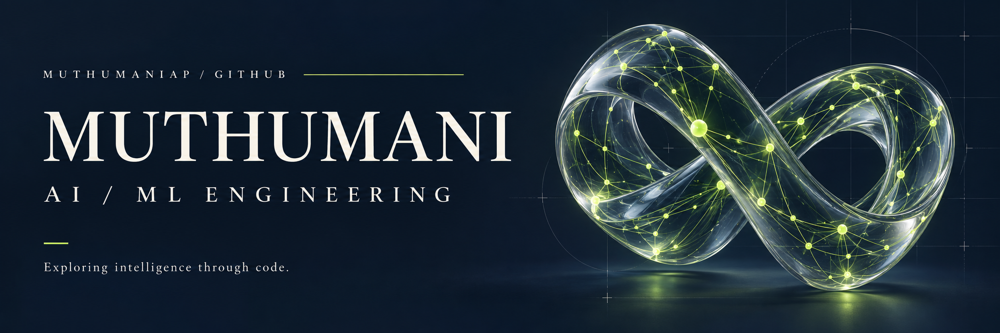
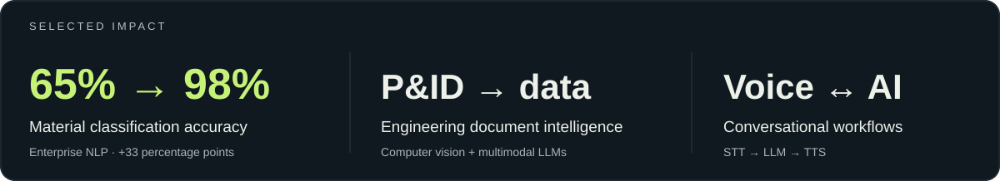
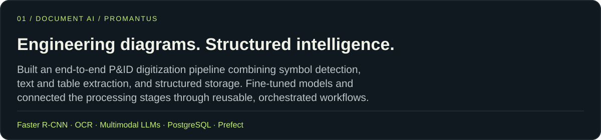
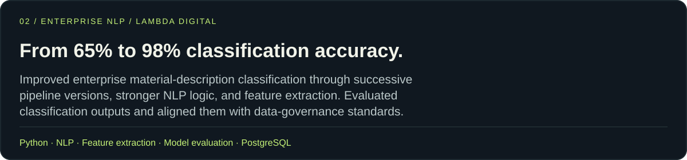
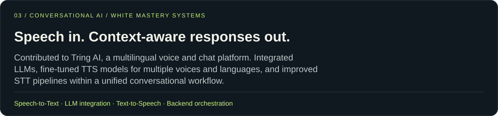

<b>MUTHUMANI AP</b> · AI/ML Engineer · Chennai, India 
Generative AI &nbsp; / &nbsp; LLMs &nbsp; / &nbsp; AI Agents &nbsp; / &nbsp; RAG

<a href="https://muthumaniap.github.io/">Portfolio ↗</a> &nbsp; · &nbsp;
<a href="https://www.linkedin.com/in/muthumaniap/">Connect on LinkedIn ↗</a> &nbsp; · &nbsp;
<a href="#selected-work">Selected work</a> &nbsp; · &nbsp;
<a href="https://github.com/Muthumaniap?tab=repositories">Explore my code ↗</a>

## From unstructured inputs to working AI systems.

I'm **Muthumani AP**, an AI/ML engineer with **2+ years of experience** building production NLP, LLM, document intelligence, and conversational AI systems. My work connects **model training and fine-tuning** with the APIs, data pipelines, and orchestration needed to make AI useful in real applications.

## Selected work

Professional projects from my experience at Promantus, Lambda Digital, and White Mastery Systems.

## Engineering beyond the model

- **Retrieval & grounding:** RAG, SentenceTransformers, embedding-based similarity search, FAISS indexing, and OpenSearch document retrieval.
- **Production workflows:** REST API integration, PostgreSQL, and Prefect flows with task dependencies, retries, scheduling, failure handling, and monitoring.
- **Model development:** training, fine-tuning, evaluation, prompt iteration, and domain-specific structured extraction.

## Tools I work with

| Area | Technologies |
| :--- | :--- |
| Generative AI & retrieval | Hugging Face Transformers, multimodal LLMs, SentenceTransformers, FAISS, OpenSearch |
| ML & computer vision | PyTorch, TensorFlow, Keras, Faster R-CNN, OpenCV, OCR |
| Backend & orchestration | Python, C#, FastAPI, REST APIs, PostgreSQL, Prefect |
| Development | Git, Linux, Ubuntu, Windows |

## Public code

[Market Analysis](https://github.com/Muthumaniap/market-analysis) &nbsp; · &nbsp; [Training Server](https://github.com/Muthumaniap/Training-Server) &nbsp; · &nbsp; [Quiblyx](https://github.com/Muthumaniap/quiblyx)

## Foundation

**B.E. in Computer Science · 2024**

Additional learning and certifications through **Infosys Springboard**, **Kaggle**, **Board Infinity**, and **HackerRank**.

---

<b>Let’s talk about AI that works beyond the notebook.</b> 
<a href="https://www.linkedin.com/in/muthumaniap/">Connect with me on LinkedIn ↗</a> 
Muthumani AP · Chennai, India

